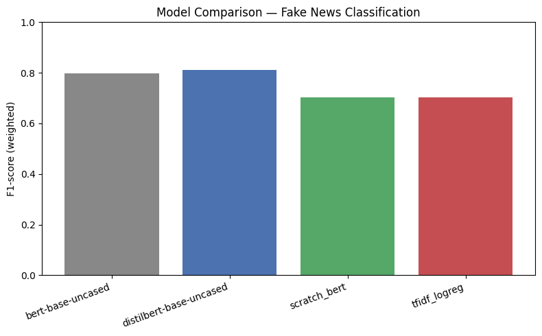
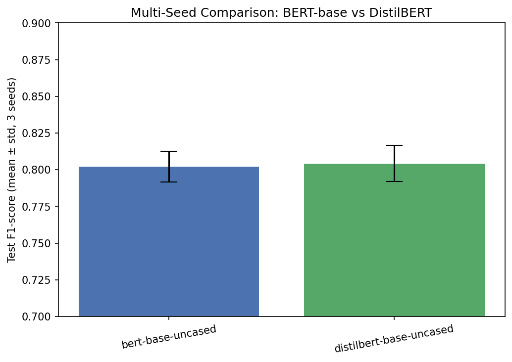
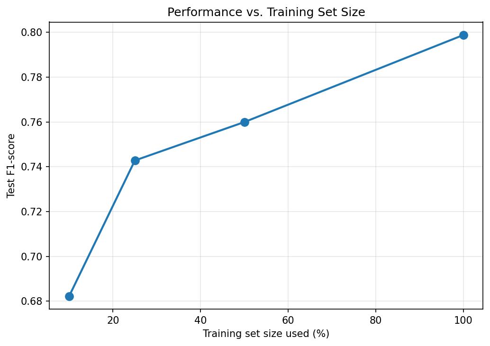

# Fake News Classification with BERT — From Scratch to Fine-Tuned

A comparative study of four modeling approaches for fake-news headline
classification on the [Fakeddit](https://github.com/entitize/Fakeddit)
dataset: a classical TF-IDF baseline, a BERT-style Transformer encoder
implemented from scratch in PyTorch, and two fine-tuned pretrained
Transformers (BERT-base, DistilBERT) — plus multi-seed evaluation,
a data-scaling ablation, error analysis, and Integrated Gradients
token-attribution.

> Originally built for CS60075 (NLP), IIT Kharagpur, Spring 2026, and
> extended into a full experimental project. All results below are taken
> directly from a completed, executed run —
> [`BERT_Fake_News_Full_Pipeline.ipynb`](BERT_Fake_News_Full_Pipeline.ipynb) —
> not estimates. See that notebook for full cell-by-cell outputs and logs.

## Overview

Fake-news detection is a text classification problem, but *how* you solve
it says a lot about what you understand: a bag-of-words baseline tells you
whether lexical cues alone are enough; building a Transformer encoder from
scratch tells you whether you understand *why* attention-based models work,
not just how to call `.fit()`; and fine-tuning pretrained Transformers
tells you how much large-scale pretraining actually buys you over both.
This project runs all three in the same experimental harness — same data
split, same metrics, same seeds — so the comparison is apples-to-apples:

**TF-IDF + Logistic Regression -> BERT implemented from scratch -> fine-tuned
DistilBERT / BERT-base**, then analyzed for robustness (multi-seed),
data efficiency (scaling ablation), failure modes (error analysis), and
interpretability (Integrated Gradients).

## Key Results

Dataset: [Fakeddit](https://github.com/entitize/Fakeddit) (968,099 combined
posts across its train/validate/test splits). All four models were trained
and evaluated on the **same balanced subsample**: 2,500 real + 2,500 fake
posts (5,000 total), split 80/20 -> **4,000 train / 1,000 test**, stratified.
This is a deliberate choice for fast, controlled iteration across four
models — not a data availability limit (the full 968K-row set is available
and the data-scaling ablation below shows how results move with more data
from within this budget).

| Model | Accuracy | F1 (weighted) |
|---|---|---|
| TF-IDF + Logistic Regression | 0.704 | 0.703 |
| BERT (from scratch, 2-layer/512-dim) | 0.702 | 0.702 |
| BERT-base (fine-tuned) | 0.799 | 0.799 |
| **DistilBERT (fine-tuned)** | **0.811** | **0.811** |



**Multi-seed results** (BERT-base and DistilBERT, 3 seeds each — see
[Experimental Findings](#experimental-findings)):

| Model | Accuracy (mean ± std) | F1 (mean ± std) |
|---|---|---|
| BERT-base | 0.8023 ± 0.0104 | 0.8022 ± 0.0104 |
| DistilBERT | 0.8043 ± 0.0124 | 0.8042 ± 0.0124 |

## Experimental Findings

**Fine-tuned Transformers clearly beat both the classical baseline and the
from-scratch model** (~+10 points F1), which is the expected and validating
result — pretraining on large text corpora gives BERT-base/DistilBERT a
big head start that neither TF-IDF nor a randomly-initialized 2-layer
Transformer can match with only 4,000 training examples.

**The from-scratch BERT did not beat the TF-IDF baseline on a single run**
(0.702 vs 0.703 F1) — essentially a tie. This is not an implementation bug
(42 unit tests confirm the attention/embedding/masking logic is correct,
and its train accuracy climbed to 0.80 while train loss fell steadily —
see the notebook's Epoch 1–6 log), it's the expected outcome of training a
randomly-initialized Transformer from scratch on only 4,000 examples: it
overfits the training set (train acc 0.80 by epoch 6) while test accuracy
peaks earlier (0.71 at epoch 5) and drifts down slightly by epoch 6 (0.70).
A from-scratch Transformer needs far more data or pretraining to
consistently beat a strong linear baseline — the comparison quantifies that
gap rather than assuming it.

**BERT-base and DistilBERT are statistically indistinguishable on this
task at this scale.** In the single-run headline table DistilBERT edges out
BERT-base (0.811 vs 0.799 F1), which could easily be read as "the smaller
model wins." The 3-seed results correct that: 0.8022 ± 0.0104 vs
0.8042 ± 0.0124 — the difference (~0.002) is well inside one standard
deviation for both models, i.e. within run-to-run noise. The honest
conclusion is **not** "DistilBERT is better," it's "the two are
comparable here, and DistilBERT gets there with 40% fewer parameters" —
which is itself a useful, defensible finding about efficiency, just not a
claim of superior accuracy.



**Performance scales with training data with diminishing returns.** Fixing
BERT-base and varying the training set size (seed 42):

| Training data used | Train size | Accuracy | F1 |
|---|---|---|---|
| 10% | 400 | 0.685 | 0.682 |
| 25% | 1,000 | 0.745 | 0.743 |
| 50% | 2,000 | 0.761 | 0.760 |
| 100% | 4,000 | 0.799 | 0.799 |

The biggest jump is 10%->25% (+6.1 F1 points from 600 more examples); each
subsequent doubling of data buys a smaller gain (+1.7, then +3.9 points).
This is consistent with the standard fine-tuning data-efficiency curve for
pretrained Transformers — most of the benefit comes early, and this run
doesn't show it having fully saturated by 4,000 examples, so more data
would plausibly help further.



## Scratch Transformer Architecture

Implemented in `src/models/` with PyTorch, matching the standard
encoder-only BERT design (`embed_dim=512, num_heads=8, num_layers=2,
ff_dim=2048` by default, all configurable via CLI flags):

- **Token, positional, and segment embeddings** (`embeddings.py`) — three
  learned embedding tables summed and passed through LayerNorm + dropout,
  as in the original BERT paper (not sinusoidal positions).
- **Multi-head self-attention** (`attention.py`) — scaled dot-product
  attention computed per-head from learned Q/K/V projections, with an
  additive attention mask for padding.
- **Position-wise feed-forward layers** (`feedforward.py`) — two-layer MLP
  with GELU activation, applied identically per token.
- **Transformer encoder blocks** (`encoder.py`) — post-LayerNorm residual
  connections around attention and the FFN, stacked `num_layers` times.
- **Pooler** (`encoder.py`) — extracts the `[CLS]` hidden state and passes
  it through a `Dense + Tanh` layer, matching BERT's pooled-output design.
- **Classification head** (`bert.py`) — dropout + linear layer on the
  pooled output.

## Explainability

Token-level attribution is implemented with
[Captum](https://captum.ai/)'s `LayerIntegratedGradients`
(`src/interpretability/integrated_gradients.py`), computing attribution
scores at the word-embedding layer against an all-zero baseline, with the
convergence delta tracked and reported per example.

**This implementation is specific to the fine-tuned `bert-base-uncased`
checkpoint (HuggingFace `BertForSequenceClassification`), not
model-agnostic.** It accesses the embedding layer directly via
`model.bert.embeddings.word_embeddings` — this attribute path exists on
BERT-family HF models but not on DistilBERT (`model.distilbert...`) or the
from-scratch model (different forward signature/output format). All IG
results in this project were computed on the fine-tuned BERT-base
checkpoint; extending it to DistilBERT would need a small architecture-aware
change to the embedding-layer lookup.

Example attributions from the executed notebook (target class = predicted
class; convergence deltas were all comfortably low, <= 0.07):

| Text | Top attributed tokens |
|---|---|
| *"katy perry shares nude snap as she plans to vote naked"* (Fake) | `nude`, `she`, `shares`, `vote`, `naked` |
| *"black with noose around neck shortly before lynching mobile alabama"* (Real) | `neck`, `with`, `lynch` |

## Error Analysis

Misclassified test examples are pulled and heuristically bucketed by
surface features (`src/evaluation/error_analysis.py`: very-short-title,
question-headline, clickbait-language, exclamatory-headline, long-title,
other). For the fine-tuned BERT-base model, of 10 sampled misclassified
examples: **7 fell into no obvious surface-level pattern ("other")**, 2
were long titles, 1 was a very short title. Reading the actual examples
(in the notebook), several look genuinely ambiguous even to a human reader
without more context — e.g. *"beautiful mountain in the sunrise"* (labeled
real, predicted fake) and *"prime minister of canada with president of
america"* (labeled fake, predicted real) — suggesting a meaningful chunk of
the error rate on this dataset comes from posts where the headline alone
doesn't carry enough signal, rather than a systematic model weakness.

## Testing

```bash
python -m pytest tests/ -v      # 42 passed
```

42 unit tests across 11 files, runnable on CPU with no dataset download or
GPU:

- **Attention** (4 tests) — output shape, rejection of invalid head counts,
  padding-mask correctness (padded tokens get ~0 attention weight), and
  that attention weights sum to 1.
- **Embeddings** (3 tests) — token/position/segment embedding shapes,
  default token-type behavior, and zero embedding at the padding index.
- **Encoder block & pooler** (3 tests) — shapes and mask propagation.
- **Full scratch `BertModel`** (4 tests) — end-to-end forward shapes, and
  — importantly — that padding tokens don't change the pooled `[CLS]`
  representation (proof the mask is wired through the *whole* stack, not
  just the first layer), determinism in eval mode, and finite parameters.
- **Training engine** (3 tests) — including a real gradient-descent check
  that loss actually decreases on a synthetic task (not just "runs without
  crashing").
- **Data pipeline** (8 tests) — cleaning, class balancing, stratified
  splitting, the train-fraction ablation logic, and an explicit
  **train/test ID-leakage check**.
- **Dataset** (4 tests) — tokenization, padding/truncation, label
  alignment.
- **Metrics** (3 tests) — accuracy/F1/confusion-matrix computation
  verified against hand-computed values.
- **Error analysis** (4 tests) — categorization logic and report building.
- **Interpretability utilities** (3 tests) — top-k token selection logic
  (does not cover `compute_ig` itself, which needs a real model + captum).
- **Results aggregation** (3 tests) — multi-run summary statistics.

## Repo structure

```
bert-fake-news/
├── BERT_Fake_News_Full_Pipeline.ipynb   # executed notebook — source of truth for all results above
├── src/
│   ├── models/            # scratch BERT: attention.py, feedforward.py, embeddings.py, encoder.py, bert.py
│   ├── data/               # preprocess.py (load/clean/balance/split), dataset.py (PyTorch Dataset)
│   ├── training/           # train_baseline.py, train_scratch.py, train_transformer.py, engine.py
│   ├── evaluation/         # metrics.py, error_analysis.py, aggregate_results.py
│   └── interpretability/   # integrated_gradients.py
├── tests/                  # 42 unit tests, run offline with pytest, no GPU/data needed
├── configs/                 # YAML hyperparameter configs per model
├── scripts/                 # shell drivers: run_all_baselines.sh, run_multiseed.sh, run_data_ablation.sh
├── app/demo_app.py          # Gradio demo (prediction + confidence + IG token highlighting)
├── results/figures/          # figures referenced in this README, extracted/regenerated from the notebook's real output
├── notebooks/                # original graded-assignment notebook + report, kept for reference
├── requirements.txt
└── NEXT_STEPS.md             # environment setup + exact commands to reproduce every result above
```

## Reproducibility

```bash
git clone <your-repo-url> && cd bert-fake-news
pip install -r requirements.txt
python -m pytest tests/ -v      # 42 passed, no GPU/data needed
```

Reproducing the trained-model results needs a GPU (Colab/Kaggle T4 is
enough) and the Fakeddit dataset. All seeds are fixed and passed explicitly
(`--seed`, default 42; multi-seed run uses 42/1/7) via
`src/utils/seed.py`, which seeds `random`, `numpy`, and `torch`
(including CUDA). Full step-by-step commands — matching exactly what
produced the results in this README — are in
**[NEXT_STEPS.md](NEXT_STEPS.md)**.

## License / academic integrity note

This repository builds on graded coursework for CS60075 at IIT Kharagpur. If
you are a current student in this or a similar course, do not submit any
part of this repository as your own assignment work — that would violate
your course's academic integrity policy. Use it as a reference for how to
extend a finished assignment into a portfolio project.
